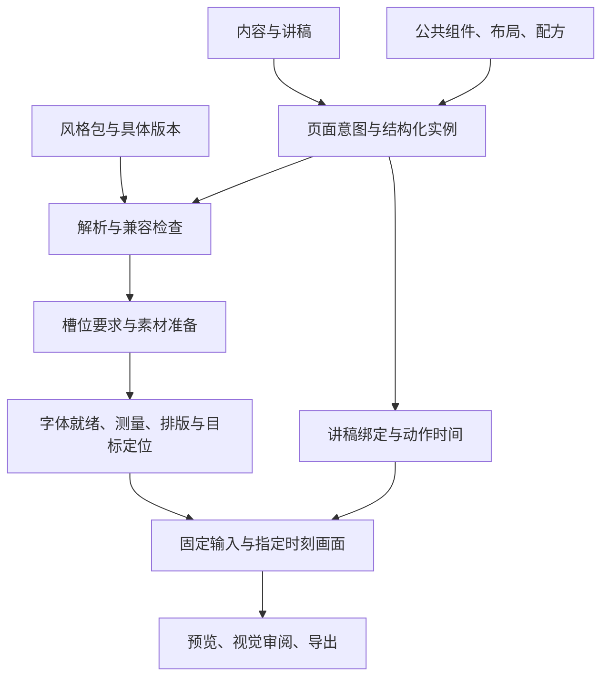

# 构建方式与公共、风格、实例的归属

所属契约包：0.5.0。本文是构建与职责归属的规范正文。

完整需求归属与新增能力的流程见 [八层体系与扩展](framework/README.md)。

## 1. HPS-001：四类数据各有所有者

整个系统由四类内容共同构建。公共表示可被不同风格与作品复用，不表示每次使用的
数值和内容都一样。

| 分类 | 定义 | 例子 | 谁负责 |
| --- | --- | --- | --- |
| 公共能力 | 数据接口、组件、布局算法、动作语义、校验和输出机制 | 标题角色、概念块、两列布局、出现动作、稳定目标 | 通用内核与定义库 |
| 风格包 | 选用的视觉参数、呈现变体、素材画风、搭配偏好和参考样例 | 标题字体、强调色、圆角、插画规范、允许的布局变体 | 风格定义与资产包 |
| 实例数据 | 某份演示实际讲什么、如何组织，以及作者的局部选择 | 标题正文、讲稿、配图引用、左右对象、动作目标、局部覆盖 | 文档/页面源数据 |
| 派生结果 | 由上述输入和运行条件计算出的结果 | 分行、坐标、勾画路径、解析时间、HTML、截图、视频 | 排版/时间/渲染/导出器 |

实例数据可以保存人工位置意图和样式覆盖，但须经定义允许；不能把手工修改的
DOM 当成作者数据，也不能把某页标题写入通用组件实现。

## 2. 全体系归属矩阵

| 部分 | 公共、不因风格改变的契约 | 风格可变部分 | 实例填写部分 | 计算生成部分 |
| --- | --- | --- | --- | --- |
| 文档/页面 | 层级、身份、页序接口、版本与引用规则 | 默认风格及其兼容画布偏好 | 标题、章节、页序、画布选择 | 全局页码、合成安排 |
| 内容 | 内容角色、关系类型、来源与覆盖接口 | 内容角色对应的视觉表现 | 实际知识点、数值、来源 | 覆盖与一致性诊断 |
| 文字 | 文本/富文本结构、文字锚点、换行和测量接口 | 字体、字号、行高、字重、颜色、字间距 | 文字与允许的局部强调 | 实际分行、占用尺寸、定位 |
| 图片 | 资源引用、裁切/适配、锚点与独立图层接口 | 画风、配色、质感、透明边界要求 | 本页主体、资源版本、焦点 | 槽位中的显示区域与锚点转换 |
| 图形/图标 | 矢量/图片能力、图标语义和目标接口 | 线性/填充、线宽、端点、颜色与图标集合 | 需要哪个图标或图形 | 实际路径、边界与渲染 |
| 分组 | 包含关系、局部坐标、变换、裁切 | 容器外观及装饰参数 | 包含哪些实例、局部约束 | 子项变换后的画布几何 |
| 组合组件 | 概念块/步骤/指标等语义模型、公开目标、状态与测量接口 | 登记的外观或结构变体、视觉参数 | 具体概念、步骤、指标 | 内部布局、DOM/SVG、目标映射 |
| 页面布局 | 槽位接口、几何算法、容量、溢出与安全区检查 | 间距、比例偏好、密度、允许变体 | 使用哪种布局、各槽放什么 | 每个槽位/组件的最终区域 |
| 页面配方 | 组合格式、槽位映射和阶段约定 | 推荐组合、素材类型、装饰用法、参考页 | 本页选择配方与填充数据 | 配方展开后的布局/组件选择 |
| 讲稿绑定 | 稳定语块与目标、文字范围、映射关系 | 可提供强调表现默认值 | 讲稿文字、对象关系、手工时间 | 音频对齐和目标解析 |
| 动作 | 出现/强调/勾画语义、状态、通道、冲突和跳转 | 缓动、幅度、笔触、允许时长范围 | 何时作用于谁、确认时长、保持策略 | 时刻 t 的可见性、变换和路径 |
| 字幕/数字人 | 独立合成轨、版本、区域与时间接口 | 可独立引用文字/框体等视觉参数 | 字幕内容、形象、区域、开关 | 字幕布局、口型片段和合成 |
| 输出 | 固定输入、能力检测、降级报告和编码/对象映射 | 间接影响视觉和导出兼容范围 | 格式、分辨率、是否要求可编辑 | HTML、图片、MP4、PPTX |
| 检查 | 引用、容量、时间、资源、版本和结果有效性 | 声明可读尺寸、密度、素材及视觉参考要求 | 本次需要保留的约束、输出策略 | 诊断与验收结果 |

布局算法是公共能力，其结果可以随风格的字体和间距而变化。素材接口是公共能力，
具体图片可以风格专属，也可以被多个兼容风格共用。公共不等于强制所有主题共用同一张图。

## 3. HPS-002：公共组件的构建层次

构建顺序为原子能力 → 语义组件 → 布局与配方 → 页面实例。

原子首轮包括文字、图片、矢量和分组。语义组件使用原子表达可编辑的概念，如概念块
保留标题/解释/配图，表格保留行列和单元格。不能把语义全部压成散落的文字与矩形。

布局分配外部区域；组件在区域内排布自身。配方引用公共布局和组件，保存经过设计
的组合参数及讲解阶段，不持有项目正文，也不复制代码。新增风格优先选用这些能力。
出现新的表达职责时，新增的是公共组件，并为它定义跨内容使用的接口及验证例子。

复用需要用替换内容、其他布局或另一种风格的例子验证。一个仅能画某张参考图的
专用函数不能仅因被命名为“组件”就登记为通用能力。

## 4. HPS-003：风格包的构建内容

风格包至少包含以下九项，首轮支持范围可以很小，但不可空缺不说明。

| 内容 | 具体定义 | 验收依据 |
| --- | --- | --- |
| 语义参数 | 背景、正文、强调等色彩用途；文字角色；间距、线条、形状 | 参数完整、用途明确、实际可用 |
| 字体资源 | 字体文件/字重、回退、版本 | 加载后真实排版，而非只写字体名 |
| 组件映射 | 概念块等使用哪个登记变体、哪些参数 | 保持内容模型与公开目标 |
| 布局配置 | 兼容布局、偏好比例、留白/密度范围 | 满足容量、安全区与可读性 |
| 素材规范 | 插图/图标的画风、配色、线条、构图、边界 | 替换资源后仍协调 |
| 可用资产 | 已产出的图标、纹理、装饰、字体与其他可复用素材 | 文件/版本可定位，许可信息如来源要求则随资产记录 |
| 动作配置 | 选用公共动作的默认缓动、时长和强弱 | 不改变讲稿目标或破坏时间关系 |
| 配方与禁用组合 | 推荐组件组合、使用限制和替代选项 | 不能支持时明确诊断 |
| 参考集 | 最终页、逐步状态、长短内容、配图变化 | 视觉审阅及约束检查通过 |

第一种风格的具体字体、色值和参数要通过样板确定；本文件没有预先批准一套外观。
已验证的风格版本不可原地换图换值改变含义，新增修改按兼容规则发版。

## 5. HPS-004：呈现变体与稳定目标

外观变化分三种：可由参数表达的变化、需要结构变体的变化、真正新增的表达能力。
颜色/线宽通常改参数；概念块图在上或在左可用结构变体；原组件完全不支持的数据
表达才考虑新增语义组件。

变体仍属于公共组件库，需要保持其声明的数据和公共目标。例如 conceptA 的 title、
body、figure 在不同变体下保持含义，渲染器负责映射到对应 DOM/几何。动画不引用
临时 CSS 选择器。变体可有适用条件，风格需声明支持哪些变体。

不能通过增加一个风格专属组件绕过接口，也不要求所有风格使用完全一样的 DOM 外形。
图片中能定位一个物体不代表它可以单独揭示，独立动画需要分层资产或声明的遮罩能力。

## 6. HPS-005：参数解析与约束

值的解析顺序是基础默认 → 风格参数 → 登记变体 → 配方默认 → 允许的文档/页面/节点
覆盖。只能覆盖定义卡声明的字段；记录解析值和来源以便排查。主题选择可以影响
布局偏好，但最终几何只由布局计算。

硬约束始终检查：槽位类型、最小可读性、容量、安全区、人工锁定及输出要求。后层
覆盖不获得豁免。冲突返回属性、来源与修复方向，不依赖 CSS 优先级偶然得出结果。
风格切换保留内容/身份，检查变体、素材和人工覆盖，再重排；缺项明确降级或报错。

## 7. 从规则到一页画面的生产顺序

布局先提供素材槽位的比例、用途和边界要求，素材准备后再完成精确测量。AI 生图
负责符合要求的视觉资产，文字/数字/标签通过可编辑节点呈现。素材供应商可以更换，
接口保持相同。生成每个需要独立出现的对象时就确定分层，不依赖后续任意切图。

作者数据先通过接口与引用检查，再解析风格与布局，得到确定几何；讲稿语块与对象
的关系再绑定到测试时间或真实音频。取帧前必须满足渲染就绪条件。预览和导出使用
同一修订的输入，检查支持集后选择适配器。具体生产门禁见生产与兼容规则。

## 8. 具体例子：同一页的两种外观

示例仅说明职责，以下字段与风格名不是已实现格式或最终设计。

页面由标题、左右两个概念块和三段讲稿组成。内容是“方式 A”“方式 B”及各自解释。

| 项目 | 清爽插画外观 | 深色演讲外观 | 是否需要新公共组件 |
| --- | --- | --- | --- |
| 实际标题与解释 | 保持原文 | 保持原文 | 否，属于同一页面内容 |
| 概念块语义 | 标题、解释、插图 | 标题、解释、插图 | 否 |
| 字体/颜色/间距 | 浅底、深文字、舒展间距 | 深底、亮文字、更强层级 | 否，换风格参数并重排 |
| 概念块结构 | 已登记的上图下文 | 已登记的侧图正文 | 否，选不同通用变体；未登记时先补变体定义 |
| 插图 | 同主体的轻线条插图 | 适配深色的视觉资源 | 可换资产引用，保持表达对象 |
| 左右区域 | 允许范围内的两列 | 允许范围内的两列 | 否，公共布局求不同参数的结果 |
| 讲稿与目标 | 语块关联 conceptA/body | 仍关联 conceptA/body | 否 |
| 揭示动效 | 轻淡入 | 另一组允许的缓动/参数 | 否，公共动作语义一致 |

换风格后最终坐标和分行可能变化，所以要重新测量、定位与视觉检查。讲稿内容没有
变化时不会因为换色自动重做音频；若替换动效默认时长则重新检查时间安排。

## 9. 新需求落在哪一层

| 发现的需求/问题 | 优先处理位置 |
| --- | --- |
| 全部内容正确，只是配色不协调 | 风格参数与参考集 |
| 声明容量内的正文在所有风格下都越界 | 公共测量/布局实现或容量规则 |
| 某风格字号过大导致多页溢出 | 该风格参数、布局适配与验证；保留公共最小可读约束 |
| 希望插图改到标题上方 | 已登记布局/组件变体；需要新变体时按通用接口扩展 |
| 同一内容适合另一种组合 | 页面配方或实例选择 |
| 想表达流程，但只有概念块 | 新公共步骤/关系组件的语义能力 |
| 配图风格一致但主体不对 | 实例素材需求、具体资源版本 |
| 换风格后圈画到了错误文字 | 稳定目标/锚点/几何链路，不能只修某一页像素 |
| 旧作品更新后变样 | 版本固定、资源保留、兼容迁移与渲染条件 |

实现违反已有规则时修实现；规则覆盖不足时修规则及受影响实现；资源不合格时修资产。
具体实例本身错误时修实例。修正规则应保留能复现问题的例子，不能通过放宽全部校验
掩盖一个案例。

## 10. 实际构建载体与完成标准

| 载体 | 作用 | 当前状态 |
| --- | --- | --- |
| 本契约目录 | 人读的职责与协作规则、规则编号 | 已建立 |
| 定义卡 | 每个公共组件、布局、风格的具体字段/行为 | P01 的 19 张最小卡已填写，见 definitions；其他候选待定义 |
| Schema/类型与注册表 | 检查输入，登记已实现能力和版本 | 待实现 |
| 公共内核 | 排版、稳定目标、动画状态、渲染与导出适配 | 待实现 |
| 风格参数与资产包 | 具体外观、支持矩阵与参考页 | 待样板验证 |
| 页面文档 | 作品内容与作者选择 | 待字段落定后生成 |
| 诊断/验收记录 | 证明规则得到执行与视觉合格 | 文档检查已做；运行与视觉验证未做 |

当前目录名与文件不是未来运行代码必须采用的模块布局。实现时仍遵守现有仓库
路径、服务和 Agent 边界；不要提前创建空功能来伪装完成上述能力。

## V1执行边界补充

[共享视觉定义卡](runtime/visual-v1/README.md)将本轮所有可执行属性归属固定：坐标和容量归布局，外观数值归主题，正文/对象/播放清单归实例，锚点归资产。完整体系允许登记局部覆盖与风格动作/布局推荐，但V1并未开放这些字段；不得绕过Schema在实例插入CSS。
